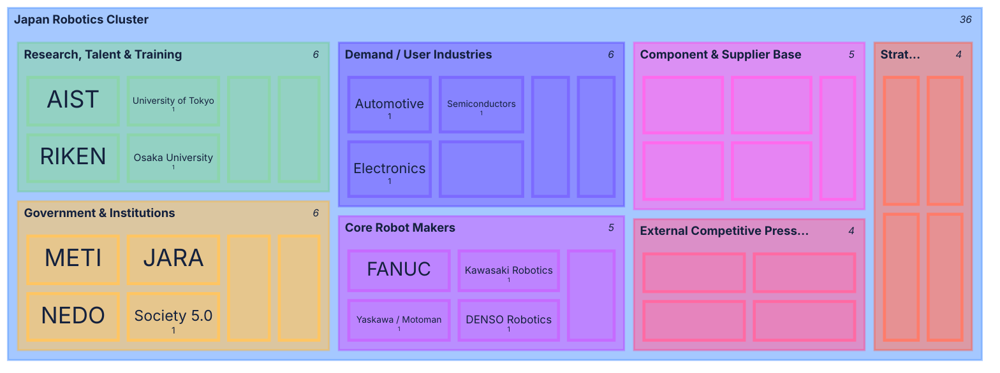

```mermaid
%%{init: {
  "theme": "base",
  "themeVariables": {
    "background": "#FAFBFC",
    "primaryColor": "#EAF2FF",
    "primaryTextColor": "#14213D",
    "primaryBorderColor": "#174A8B",
    "lineColor": "#8EA4C2",
    "secondaryColor": "#E9F7EF",
    "tertiaryColor": "#FFF4E1",
    "fontFamily": "Inter, Segoe UI, Arial"
  }
}}%%

treemap-beta
    "Japan Robotics Cluster"
        "Core Robot Makers"
            "FANUC": 1
            "Yaskawa / Motoman": 1
            "Kawasaki Robotics": 1
            "DENSO Robotics": 1
            "OMRON Automation": 1

        "Component & Supplier Base"
            "Sensors: Keyence / Toshiba / Panasonic": 1
            "Semiconductors: Renesas / Sony / Toshiba": 1
            "Machine Tools: Mazak / Okuma / DMG Mori": 1
            "Motion Control & Drives": 1
            "Controls & Factory Automation": 1

        "Research, Talent & Training"
            "AIST": 1
            "RIKEN": 1
            "University of Tokyo": 1
            "Osaka University": 1
            "Technical Colleges": 1
            "Robotics Engineering Programs": 1

        "Government & Institutions"
            "METI": 1
            "NEDO": 1
            "JARA": 1
            "Society 5.0": 1
            "Moonshot R&D Program": 1
            "Robot Revolution Initiative": 1

        "Demand / User Industries"
            "Automotive": 1
            "Electronics": 1
            "Semiconductors": 1
            "Healthcare & Eldercare": 1
            "Logistics & Infrastructure": 1
            "Agriculture / Disaster Response": 1

        "External Competitive Pressure"
            "China: largest market + cost pressure": 1
            "United States: AI / software / autonomy": 1
            "South Korea: highest robot density": 1
            "Germany: precision + Mittelstand": 1

        "Strategic Tensions"
            "Hardware leadership vs AI / software gap": 1
            "Aging population + labor shortage": 1
            "Low SME automation adoption": 1
            "Weak service robotics edge": 1
```